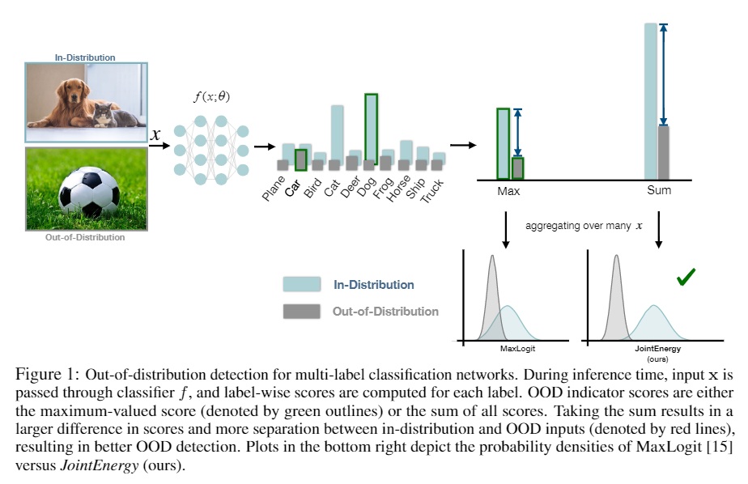
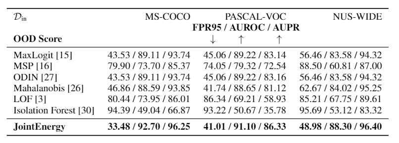

# Can multi-label classification networks know what they don’t know? 

This is a [PyTorch](http://pytorch.org) implementation of [Can multi-label classification networks know what they don't know?](......) by Haoran Wang, Weitang Liu, Alex Bocchieri, Sharon Li. 
Code is modified from
[multilabel-ood](https://github.com/xksteven/multilabel-ood),
[ODIN](https://github.com/facebookresearch/odin),
[Outlier Exposure](https://github.com/hendrycks/outlier-exposure), and
[deep Mahalanobis
detector](https://github.com/pokaxpoka/deep_Mahalanobis_detector)


## Datasets

### In-distribution dataset

PASCAL-VOC: please download the dataset from
[this mirror](https://pjreddie.com/projects/pascal-voc-dataset-mirror/). Parsed labels for PASCAL-VOC are under ./dataset/pascal folder. Create the symlink to the location of Pascal dataset.

```
ln -s path/to/PASCALdataset Pascal
```

COCO: please download the MS-COCO 2014 dataset from [here](http://cocodataset.org/#download). Install the pycocotools to preprocess the dataset

```
pip3 install git+https://github.com/waleedka/coco.git#egg=pycocotools&subdirectory=PythonAPI
```

Preprocess the COCO dataset.

```
python3 utils/coco-preprocessing.py  path/to/coco-dataset
```

NUS-WIDE: please download the dataset from [here](https://lms.comp.nus.edu.sg/wp-content/uploads/2019/research/nuswide/NUS-WIDE.html). Parsed labels for NUS-WIDE are under ./dataset/nus-wide folder.

### Out-of-distribution dataset

OOD dataset can be downloaded
[here](https://drive.google.com/drive/folders/1BGMRQz3eB_npaGD46HC6K_uzt105HPRy?usp=sharing)

## Pre-trained models
Pre-trained models can be downloaded from
[here](https://drive.google.com/drive/folders/1ZfWB6vSYTK004j0bmfj6W0Xs6kwDTFX0?usp=sharing).

## Training the models

### Below are the examples on COCO dataset. 

Train the densenet model for COCO dataset
```
python3 train.py --arch densenet --dataset coco --save_dir ./saved_models/
```

Evaluate the trained model
```
python3 validate.py --arch densenet --dataset coco --load_path ./saved_models/
```

## OOD dection

To reproduce the JointEnergy score for COCO dataset, please run: 

```
python3 eval.py --arch densenet --dataset coco --ood_data imagenet --ood energy
--method sum 
```

To reproduce the scores for logit/msp/prob/lof/isol, please run:

```
python3 eval.py --arch densenet --dataset coco --ood_data imagenet --ood
logit/msp/prob/lof/isol/ --method max
```

To finetune the parameters for Odin and Mahalanobis, please run:
```
python3 fine_tune.py --arch densenet --dataset coco --ood odin/M --method max
```

After getting the best_T and best_noise, please run the evaluation:
```
python3 eval.py --arch densenet --dataset coco --ood_data imagenet --ood odin/M
--method max --T best_T --noise --best_noise
```

## OOD Detection Result
OOD detection performance comparison using JointEnergy vs. competitive
baselines.


## Citation
     @article{wang2021canmulti,
          title={Can multi-label classification networks know what they don't know?},
          author={Wang, Haoran and Liu, Weitang and Bocchieri, Alex and Li, Yixuan},
          journal={Advances in Neural Information Processing Systems},
          year={2021}
     } 
